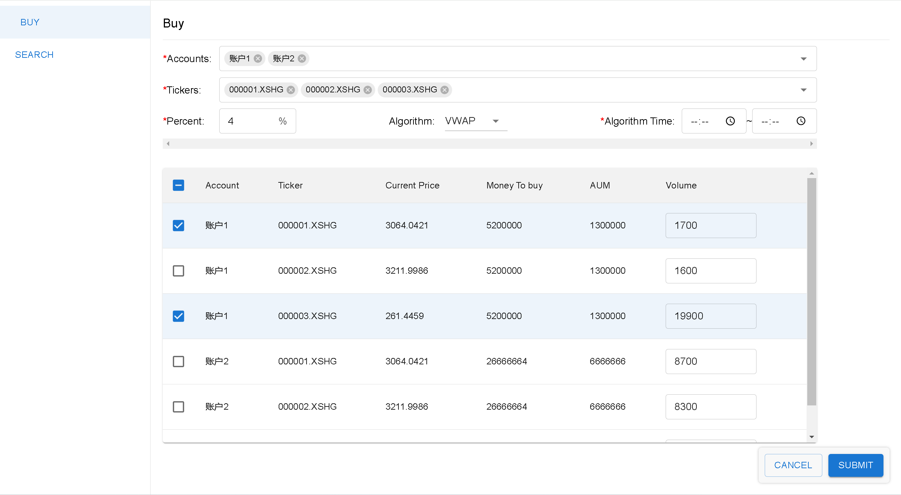

# TradeMaster

Author: <a href="https://github.com/fmw666">@fmw666</a>
 
Date: 2024-03-28 
Mail: <a href="mailto:<EMAIL>">fmw19990718@gmail.com</a>
 
Phone: +86 18008145963

### ✨ Quick Start Guide

1. Install Python 3.7 or higher.
2. Install the required packages using pip: `pip install -r requirements.txt`
3. Cd into the `backend` directory and Run the main.py file using Python: `python main.py`
4. Cd into the `frontend` directory and Run the npm start command: `npm install && npm start`
5. Open your browser and go to `http://localhost:3000` to access the frontend.

Note: If you are running the application on a different port, make sure to update the port number in the frontend and backend code.

### 🧩 Technologies Used

- Python 3.7+
- FastAPI
- SQLite3
- React.js
- Material UI

### 🎈 Previews

